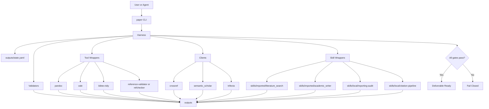

# paper-writer - Repository Architecture

## Purpose

Define where the CLI lives, where external tools are integrated, where imported skills are stored, and how the end-to-end workflow runs.

This document is intentionally practical.
It defines the repository shape needed to build the base first, before integrating domain-specific writing workflows.

## Architectural Principle

The repository has four layers:

1. **CLI layer** — the entrypoint the agent or user runs
2. **Harness layer** — workflow control, state machine, gate enforcement
3. **Integration layer** — wrappers around external tools and imported skills
4. **Artifact layer** — templates, outputs, logs, manifests, rendered documents

The CLI does not contain business logic.
The harness does not call system binaries directly.
Tool wrappers and skill wrappers isolate that behavior.

## Placement Decisions

## 1. CLI

The project CLI lives under:

```text
cli/paper/
```

Recommended files:

```text
cli/paper/
  __init__.py
  main.py
  commands/
    init.py
    verify.py
    search.py
    draft.py
    render.py
```

Responsibility:

- parse arguments
- route commands to harness actions
- print user-facing status
- never embed workflow rules directly

## 2. Harness

The harness lives under:

```text
harness/
```

Recommended files:

```text
harness/
  __init__.py
  state_manager.py
  gates.py
  orchestrator.py
```

Responsibility:

- load and update `outputs/state.yaml`
- validate and serialize stage/gate transitions
- decide whether a command is allowed to run
- aggregate results from validators, tools, and skills
- produce pass/fail delivery decisions and final manifest artifacts

## 3. External Tool Wrappers

External tools should NOT be scattered across the CLI or harness.
They should be wrapped under:

```text
integrations/tools/
```

Recommended files:

```text
integrations/tools/
  pandoc.py
  vale.py
  bibtex_tidy.py
  refs_validator.py
```

Responsibility:

- check if a CLI exists in PATH
- build commands consistently
- normalize stdout/stderr/results into structured Python responses
- fail closed when a required dependency is missing

Important rule:

- tools are **installed**, not cloned, by default
- clone a tool only if package install is not sufficient or reproducibility requires vendoring

## 4. API Clients

HTTP API clients for citation verification and metadata lookup.
All clients use stdlib only (`urllib`, `http.client`, `json`) — no external dependencies.

```text
clients/
```

Files:

```text
clients/
  __init__.py              # Package docstring
  crossref.py              # Crossref REST API client (DOI lookup, title search)
  semantic_scholar.py      # Semantic Scholar API client (DOI lookup, title search)
  trifecta.py              # Trifecta MCP client (code navigation, semantic search)
  llm_content.py           # LLM content generation client
  _retry.py                # Shared retry with exponential backoff (HTTP 429)
  _text_similarity.py      # Shared title normalization + SequenceMatcher (0.70 threshold)
```

Responsibility:

- verify DOIs and search by title across Crossref and Semantic Scholar
- return structured `VerificationResult` dataclass (never raise on API errors)
- handle rate limiting via shared `_retry.retry_with_backoff()` (2s, 4s, 8s backoff)
- detect outage latches (Semantic Scholar: 5xx → 10-minute latch)

Design rules:

- clients return `found=False` on any error — never raise to callers
- `_get()` handles `JSONDecodeError`/`UnicodeDecodeError`; public methods handle `URLError`
- all `except Exception:` blocks log before returning (no silent swallowing)
- Semantic Scholar uses DI (`_sleep`, `_clock`) for testability
- Crossref wires `on_retry` callback for observability
- DOI URLs are percent-encoded (`urllib.parse.quote`)
- logging uses `%s` lazy evaluation, never f-strings

## 5. Imported and Local Skills

Skills should be split into two groups:

```text
skills/imported/
skills/local/
```

### `skills/imported/`

Use this for skills vendored from external repos. Each imported skill reflects its real source:

```text
skills/imported/
  academic_writer/
    __init__.py            # Docstring documenting source + what was imported
    SKILL.md               # Vendored from source (prompt collection — no Python code)
    drafting.py            # Adapted from SKILL.md: section structure + LLM content generation
    sections_manifest.json # Section metadata: model, tone, word_count, subsections
  literature_search/
    __init__.py            # Re-exports from scoring.py
    scoring.py             # Vendored verbatim from source (PICO clinical scoring engine)
    scoring_cs.py          # NEW: CS domain scoring (venue, recency, citations, relevance, rigor)
    search.py              # Wraps scoring engines with domain dispatch (CS vs clinical)
    resources/
      __init__.py
      SKILL.md             # Vendored: 5-phase systematic review agent instructions
      search-protocol.md   # Vendored: database strategies, API usage
      ranking-criteria.md  # Vendored: scoring A-E formula, tiers
      critical-appraisal.md  # Vendored: RoB assessment
      synthesis-protocol.md  # Vendored: Phase 5 claim verification
      citation-format.md   # Vendored: APA 7th & Vancouver
      examples.md          # Vendored: worked examples
```

**Source paths:**
- literature-search: `skills/imported/literature_search/` (vendored)
- academic-writer: `skills/imported/academic_writer/` (vendored)

**What `scoring.py` contains (REAL imported code):**
- `PaperMetrics` — frozen dataclass with all scoring dimensions
- `ScoringWeights` — configurable weights (sum to 1.0)
- `calculate_d_score()` — methodological quality composite
- `calculate_final_score()` — weighted A-E score
- `classify_tier()` — maps score to Tier 1/2/3/Discard
- `get_default_weights()` — phase-specific presets
- `deduplicate()` — DOI/PMID/title similarity dedup with stop-word filtering
- `verify_citation()` — CrossRef/PubMed API verification

**What `scoring_cs.py` contains (NEW — CS domain scoring):**
- `CSMetrics` — frozen dataclass: venue_tier, recency, citations, relevance, rigor
- `CSWeights` — configurable weights (sum to 1.0)
- `calculate_cs_final_score()` — normalized weighted sum × 10 for classify_tier() scale
- `score_venue()` — whole-word regex venue matching (ICSE=5.0, EMNLP=4.5, arXiv=2.0)
- `score_recency()` — linear decay 0.10/yr, floor 0.20
- `score_citations()` — per-year normalization, None→0.5 conservative default
- `score_relevance()` — keyword overlap between query and title+abstract
- `score_rigor()` — priority-ordered keyword heuristic (human > benchmark > case > theoretical)
- `detect_domain()` — whole-word regex CS venues, multi-word clinical phrases, default "cs"
- `extract_cs_metrics()` — composes all scoring functions from paper dict
- `get_default_cs_weights()` — 3 phase presets (balanced, rigorous, exploratory)

**Domain dispatch** (in `search.py:_extract_metrics()`):
- CS papers → `scoring_cs.py` (CSMetrics + calculate_cs_final_score)
- Clinical papers → `scoring.py` (PaperMetrics + calculate_final_score, UNCHANGED)
- Detection: CS venue regex → "cs", ≥2 clinical phrases → "clinical", explicit `domain` field override

**What `drafting.py` adapts (NOT copied verbatim):**
- Source SKILL.md is a prompt collection with 7 section prompts
- No Python code in source — `drafting.py` extracts section structures
  (CARS model for intro, CONSORT for methods, APA 7th for results)
- Generates section skeletons with optional LLM content via `_try_llm_generation()`
- When `PAPER_LLM_CLI=claude|codex|gemini`, calls LLM CLI via subprocess
- When no LLM CLI configured, falls back to structural placeholders

Each imported skill is a self-contained module with no dependency on `harness/` or `cli/`.

### `skills/local/`

Use this for repo-native adapters and orchestration surfaces:

```text
skills/local/
  __init__.py
  adapters.py            # LiteratureSearchAdapter, AcademicWriterAdapter
```

`skills/local/adapters.py` bridges imported skills into the `harness.ports.skill_adapter.SkillAdapter` contract. It imports from:
- `harness.ports.skill_adapter` (the port interface)
- `skills.imported.academic_writer.drafting` (the concrete skill)
- `skills.imported.literature_search.search` (the concrete skill)

### Dependency Direction (enforced)

```text
harness/  ← imports from nowhere in skills/
skills/local/ ← imports from harness/ports/ and skills/imported/
skills/imported/ ← imports from nowhere in harness/ or skills/local/
cli/ ← imports from skills/local/ and harness/
```

Verified by: `grep -rn "^from skills" harness/` → empty, `grep -rn "^from harness" skills/imported/` → empty.

## 6. Vendored External Repositories

If an external repository truly needs to be cloned for reference or assets, place it under:

```text
vendor/
```

Example:

```text
vendor/
  scientific-agent-skills/
  medsci-skills/
```

Rules:

- vendor repos are read-only reference surfaces
- runtime code must not depend on the full vendor tree unless explicitly justified
- prefer extracting only what is needed into `skills/local/` or docs

## 7. Validators

Custom validators live under:

```text
validators/
```

Recommended files:

```text
validators/
  refs.py
  citations.py
  structure.py
  reporting.py
  style.py
```

Responsibility:

- citation key consistency
- `.bib` minimum metadata requirements
- section presence and structure
- reporting checklist completeness
- strong-claim and language policy checks

## 8. Templates and Styles

Place templates here:

```text
templates/
```

Place style and citation assets here:

```text
styles/
  vale/
  csl/
```

Recommended structure:

```text
templates/
  manuscript.qmd
  references.bib
  journals/

styles/
  vale/
    paper-writer/
  csl/
    vancouver.csl
    apa.csl
```

## 9. Outputs and State

Generated artifacts live under:

```text
outputs/
```

This folder should contain both workflow state and produced artifacts.

Recommended structure:

```text
outputs/
  state.yaml
  manifest.yaml
  search/
  drafts/
  render/
  logs/
```

`outputs/state.yaml` is the minimum workflow source of truth.

## 10. Tests

Tests should mirror the system shape:

```text
tests/
  cli/
  harness/
  validators/
  integrations/
  test_clients/
  clients/
```

This keeps failures attributable to a single layer.

## Runtime Diagram



## Repository Layout Diagram

```text
paper-writer/
  AGENTS.md
  README.md
  TECHNICAL_BOOTSTRAP.md
  cli/
    paper/
  harness/
  clients/
  integrations/
    tools/
  validators/
  skills/
    imported/
    local/
  vendor/
  templates/
  styles/
    vale/
    csl/
  outputs/
    state.yaml
  tests/
  docs/
```

## Clone vs Install Policy

| Surface | Default policy | Destination |
|---|---|---|
| `pandoc`, `vale`, `bibtex-tidy`, validators | install | system / venv / package manager |
| imported project skills | copy or subtree-import | `skills/imported/` |
| new repo-native skills | create locally | `skills/local/` |
| external reference repos | clone only if needed | `vendor/` |

## Initial Base Build Order

1. create `cli/paper/`
2. create `harness/state_manager.py`, `harness/gates.py`, and `harness/orchestrator.py`
3. create `integrations/tools/`
4. create `validators/`
5. create `outputs/state.yaml` with the authoritative nested `gates:` schema
6. create `tests/cli/`, `tests/harness/`, `tests/validators/`
7. only after that import `skills/imported/`

## Design Constraints

- The CLI must remain thin.
- The harness owns workflow truth.
- Wrappers own external side effects.
- Clients own API communication and never raise on errors.
- Skills are invoked through adapters, not ad hoc path reads from commands.
- Outputs must stay inside this repository.
- The system must fail closed if a required dependency or gate is missing.

## Dependency Assembly

The CLI delegates all concrete dependency construction to `harness/services/orchestrator_builder.py`. This module exposes `build_orchestrator_dependencies()` which assembles the state manager, artifact checker, action runner, tool wrappers, and skill adapters into a frozen `OrchestratorDependencies` container. The CLI imports only the builder function and `Orchestrator` — no concrete adapter or wrapper imports leak into the entrypoint.
