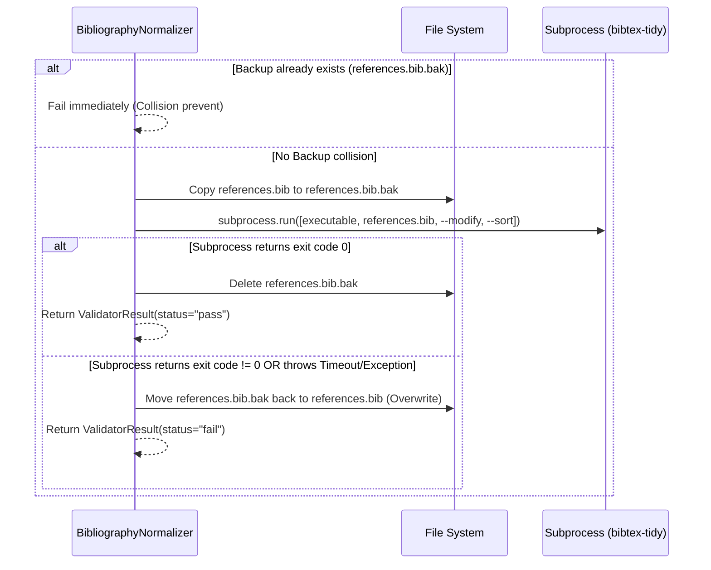

# Design — Bibtex-Tidy Hardening

This document defines the technical design, class interfaces, environment variables, and execution parameters for hardening the `bibtex-tidy` integration.

---

## 1. Directory Structure

```text
paper-writer/
  tools/
    node/
      package.json       # Pinned dependencies
      pnpm-lock.yaml     # Frozen lockfile
      node_modules/
        .bin/
          bibtex-tidy    # Local executable
```

---

## 2. Environment Variables & Configuration

*   `BIBTEX_TIDY_BIN` (String / Path): An absolute or relative path to a custom `bibtex-tidy` binary. If set, this overrides any other resolution logic and bypasses the local toolchain.
*   `BIBTEX_TIDY_ALLOW_GLOBAL` (Boolean / `"true"` or `"false"`): Determines if the wrapper is allowed to fall back to the system `PATH` if no local toolchain or environment binary is resolved. Defaults to `"false"`.

---

## 3. Class Design & Helper Interfaces

We will update the `BibliographyNormalizer` class in `integrations/tools/bibtex_tidy.py`.

```python
class BibliographyNormalizer(ToolWrapper):
    # Existing properties: name, gate, is_available

    def run(self, artifacts: dict[str, Any], context: dict[str, Any]) -> ValidatorResult:
        # 1. Resolve path to executable using _resolve_executable(context)
        # 2. If None: execute _builtin_validate() with degraded status mapping
        # 3. Check version using _verify_version(executable)
        # 4. Check if backup_path exists: if yes, fail immediately (collision protection)
        # 5. Create backup copy: shutil.copy2(bib_file, backup_path)
        # 6. Run process using subprocess.run(..., timeout=30)
        # 7. If success (exit code == 0): unlink backup
        # 8. If fail (exit code != 0 or Exception): restore backup with shutil.move, report failure
        pass

    def _resolve_executable(self, context: dict[str, Any]) -> Path | None:
        """Resolves the executable path.
        Priority:
        1. ENV override: BIBTEX_TIDY_BIN (if set, fails fast if invalid, no fallbacks)
        2. Local toolchain: repo_path/tools/node/node_modules/.bin/bibtex-tidy
        3. Global PATH: only if BIBTEX_TIDY_ALLOW_GLOBAL == 'true'
        """
        pass

    def _verify_version(self, executable: Path) -> tuple[bool, str]:
        """Runs the executable with '--version'.
        Sanitizes output and matches against the expected '1.12.0' string.
        """
        pass
```

---

## 4. Subprocess Isolation & Output Interception

*   **No Shell Evaluation**: `shell=True` is strictly forbidden to prevent injection vulnerabilities.
*   **Time Limitation**: A timeout of `30` seconds is set to prevent hanging processes.
*   **Output Interception**: `stdout` and `stderr` are captured via `capture_output=True`.
*   **Degraded reporting**: If fallback is triggered, the result returned must contain `summary="normalization skipped / builtin validation used"`.

---

## 5. Recovery Protocol Sequence


