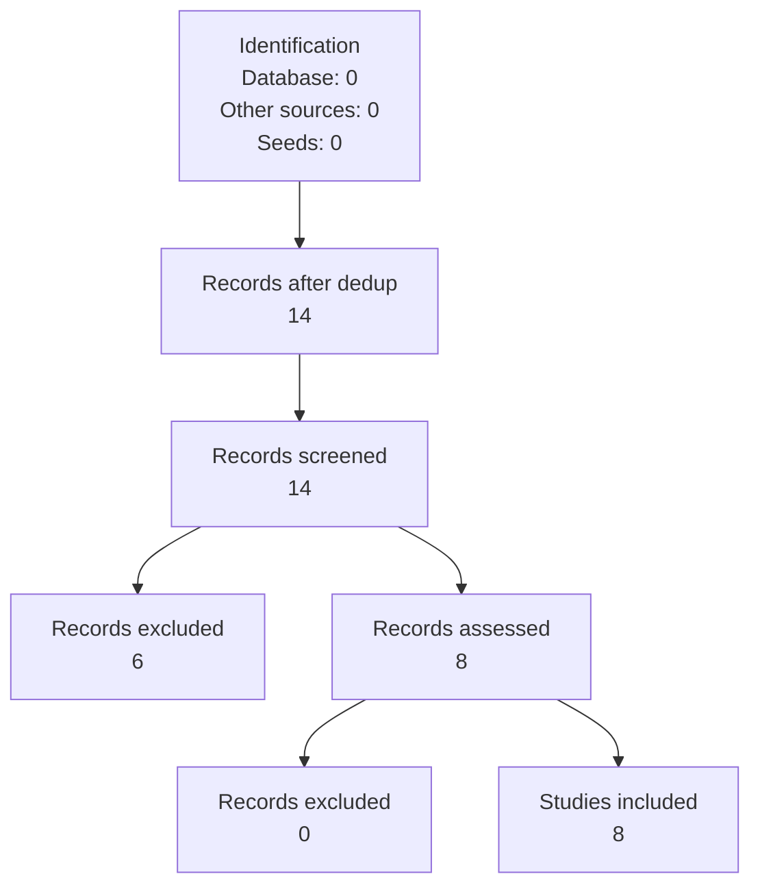

# Abstract

<!--
Structure: sections_manifest.json (from SKILL.md v1.2.0)
Model: structured_paragraph
Tone: direct, precise, dense with information, Q1 journal standard
Word count: 250-300
Rules: No citations; No abbreviations not first defined; No vague statements like 'results are discussed'
Full prompt: SKILL.md
-->

## 1-2 sentences establishing research problem and why it matters
[Content placeholder: 1-2 sentences establishing research problem and why it matters for  [@su2024evor, @tao2025racg, @zhang2023repocoder, @wang2025coderagbench, @shrivastava2023repofusion, @parvez2021ragcode, @jimenez2023swebench, @yang2024sweagent]]

## Main objectives or research questions
[Content placeholder: Main objectives or research questions for  [@su2024evor, @tao2025racg, @zhang2023repocoder, @wang2025coderagbench, @shrivastava2023repofusion, @parvez2021ragcode, @jimenez2023swebench, @yang2024sweagent]]

## Methodology: study design, participants, key procedures
[Content placeholder: Methodology: study design, participants, key procedures for  [@su2024evor, @tao2025racg, @zhang2023repocoder, @wang2025coderagbench, @shrivastava2023repofusion, @parvez2021ragcode, @jimenez2023swebench, @yang2024sweagent]]

## Most important findings with specificity (key statistics if applicable)
[Content placeholder: Most important findings with specificity (key statistics if applicable) for  [@su2024evor, @tao2025racg, @zhang2023repocoder, @wang2025coderagbench, @shrivastava2023repofusion, @parvez2021ragcode, @jimenez2023swebench, @yang2024sweagent]]

## 1-2 sentences on implications for theory, practice, or policy
[Content placeholder: 1-2 sentences on implications for theory, practice, or policy for  [@su2024evor, @tao2025racg, @zhang2023repocoder, @wang2025coderagbench, @shrivastava2023repofusion, @parvez2021ragcode, @jimenez2023swebench, @yang2024sweagent]]

# Introduction

<!--
Structure: sections_manifest.json (from SKILL.md v1.2.0)
Model: CARS
Tone: human-like, conversational academic, varied sentence lengths, natural pauses
Word count: not specified
Full prompt: SKILL.md
-->

## Introduce topic and explain real-world or theoretical issue
[Content placeholder: Introduce topic and explain real-world or theoretical issue for  [@su2024evor, @tao2025racg, @zhang2023repocoder, @wang2025coderagbench, @shrivastava2023repofusion, @parvez2021ragcode, @jimenez2023swebench, @yang2024sweagent]]

## Problem statement: ideal situation vs current shortfall
[Content placeholder: Problem statement: ideal situation vs current shortfall for  [@su2024evor, @tao2025racg, @zhang2023repocoder, @wang2025coderagbench, @shrivastava2023repofusion, @parvez2021ragcode, @jimenez2023swebench, @yang2024sweagent]]

## Previous attempts and why they don't solve the problem
[Content placeholder: Previous attempts and why they don't solve the problem for  [@su2024evor, @tao2025racg, @zhang2023repocoder, @wang2025coderagbench, @shrivastava2023repofusion, @parvez2021ragcode, @jimenez2023swebench, @yang2024sweagent]]

## Direct and indirect results of the problem and consequences
[Content placeholder: Direct and indirect results of the problem and consequences for  [@su2024evor, @tao2025racg, @zhang2023repocoder, @wang2025coderagbench, @shrivastava2023repofusion, @parvez2021ragcode, @jimenez2023swebench, @yang2024sweagent]]

## Knowledge gap this study fills and why this approach is necessary
[Content placeholder: Knowledge gap this study fills and why this approach is necessary for  [@su2024evor, @tao2025racg, @zhang2023repocoder, @wang2025coderagbench, @shrivastava2023repofusion, @parvez2021ragcode, @jimenez2023swebench, @yang2024sweagent]]

## Key studies: how work builds on or differs from them
[Content placeholder: Key studies: how work builds on or differs from them for  [@su2024evor, @tao2025racg, @zhang2023repocoder, @wang2025coderagbench, @shrivastava2023repofusion, @parvez2021ragcode, @jimenez2023swebench, @yang2024sweagent]]

## Theory or conceptual model guiding the study
[Content placeholder: Theory or conceptual model guiding the study for  [@su2024evor, @tao2025racg, @zhang2023repocoder, @wang2025coderagbench, @shrivastava2023repofusion, @parvez2021ragcode, @jimenez2023swebench, @yang2024sweagent]]

## Objectives of the study
[Content placeholder: Objectives of the study for  [@su2024evor, @tao2025racg, @zhang2023repocoder, @wang2025coderagbench, @shrivastava2023repofusion, @parvez2021ragcode, @jimenez2023swebench, @yang2024sweagent]]

## CARS model paragraph: establish territory, identify niche, occupy niche
[Content placeholder: CARS model paragraph: establish territory, identify niche, occupy niche for  [@su2024evor, @tao2025racg, @zhang2023repocoder, @wang2025coderagbench, @shrivastava2023repofusion, @parvez2021ragcode, @jimenez2023swebench, @yang2024sweagent]]

# Literature Review

<!--
Structure: sections_manifest.json (from SKILL.md v1.2.0)
Model: critical_synthesis
Tone: formal academic style, logical flow, Q1 journal standard
Word count: 1000-1200
Full prompt: SKILL.md
-->

## Broad topic statement and significance
[Content placeholder: Broad topic statement and significance for  [@su2024evor, @tao2025racg, @zhang2023repocoder, @wang2025coderagbench, @shrivastava2023repofusion, @parvez2021ragcode, @jimenez2023swebench, @yang2024sweagent]]

## Critical synthesis of most relevant literature
[Content placeholder: Critical synthesis of most relevant literature for  [@su2024evor, @tao2025racg, @zhang2023repocoder, @wang2025coderagbench, @shrivastava2023repofusion, @parvez2021ragcode, @jimenez2023swebench, @yang2024sweagent]]

## Examine each study: aim, method, findings, limitations
[Content placeholder: Examine each study: aim, method, findings, limitations for  [@su2024evor, @tao2025racg, @zhang2023repocoder, @wang2025coderagbench, @shrivastava2023repofusion, @parvez2021ragcode, @jimenez2023swebench, @yang2024sweagent]]

## Identify patterns, contradictions, knowledge gaps
[Content placeholder: Identify patterns, contradictions, knowledge gaps for  [@su2024evor, @tao2025racg, @zhang2023repocoder, @wang2025coderagbench, @shrivastava2023repofusion, @parvez2021ragcode, @jimenez2023swebench, @yang2024sweagent]]

## Assess overall condition of the literature
[Content placeholder: Assess overall condition of the literature for  [@su2024evor, @tao2025racg, @zhang2023repocoder, @wang2025coderagbench, @shrivastava2023repofusion, @parvez2021ragcode, @jimenez2023swebench, @yang2024sweagent]]

## How your research addresses the gap
[Content placeholder: How your research addresses the gap for  [@su2024evor, @tao2025racg, @zhang2023repocoder, @wang2025coderagbench, @shrivastava2023repofusion, @parvez2021ragcode, @jimenez2023swebench, @yang2024sweagent]]

# Methods

<!--
Structure: sections_manifest.json (from SKILL.md v1.2.0)
Model: CONSORT/PRISMA
Tone: clear, detailed, human-like academic, past tense, sufficient for replication
Word count: 800
Rules: No em-dashes; Do not report results; Detail sufficient for replication
Full prompt: SKILL.md
-->

## Study design and justification
[Content placeholder: Study design and justification for  [@su2024evor, @tao2025racg, @zhang2023repocoder, @wang2025coderagbench, @shrivastava2023repofusion, @parvez2021ragcode, @jimenez2023swebench, @yang2024sweagent]]

## Research setting and timeframe
[Content placeholder: Research setting and timeframe for  [@su2024evor, @tao2025racg, @zhang2023repocoder, @wang2025coderagbench, @shrivastava2023repofusion, @parvez2021ragcode, @jimenez2023swebench, @yang2024sweagent]]

## Ethics statement: approval, institution, informed consent
[Content placeholder: Ethics statement: approval, institution, informed consent for  [@su2024evor, @tao2025racg, @zhang2023repocoder, @wang2025coderagbench, @shrivastava2023repofusion, @parvez2021ragcode, @jimenez2023swebench, @yang2024sweagent]]

## Participants or subjects: population, sampling, inclusion/exclusion, demographics
[Content placeholder: Participants or subjects: population, sampling, inclusion/exclusion, demographics for  [@su2024evor, @tao2025racg, @zhang2023repocoder, @wang2025coderagbench, @shrivastava2023repofusion, @parvez2021ragcode, @jimenez2023swebench, @yang2024sweagent]]

## Equipment and materials: tools, devices, substances with justification
[Content placeholder: Equipment and materials: tools, devices, substances with justification for  [@su2024evor, @tao2025racg, @zhang2023repocoder, @wang2025coderagbench, @shrivastava2023repofusion, @parvez2021ragcode, @jimenez2023swebench, @yang2024sweagent]]

## Study procedures: chronological, interventions, data collection
[Content placeholder: Study procedures: chronological, interventions, data collection for  [@su2024evor, @tao2025racg, @zhang2023repocoder, @wang2025coderagbench, @shrivastava2023repofusion, @parvez2021ragcode, @jimenez2023swebench, @yang2024sweagent]]

## Outcome measures: primary and secondary outcomes
[Content placeholder: Outcome measures: primary and secondary outcomes for  [@su2024evor, @tao2025racg, @zhang2023repocoder, @wang2025coderagbench, @shrivastava2023repofusion, @parvez2021ragcode, @jimenez2023swebench, @yang2024sweagent]]

## Statistical analysis: tests, significance level, power analysis, software
[Content placeholder: Statistical analysis: tests, significance level, power analysis, software for  [@su2024evor, @tao2025racg, @zhang2023repocoder, @wang2025coderagbench, @shrivastava2023repofusion, @parvez2021ragcode, @jimenez2023swebench, @yang2024sweagent]]

## PRISMA Flow Diagram

# Results

<!--
Structure: sections_manifest.json (from SKILL.md v1.2.0)
Model: APA_7th_reporting
Tone: careful researcher presenting evidence, not machine listing numbers
Word count: not specified
Rules: Describe what data shows without interpretation; Reference tables and figures without duplicating content; Natural transitions between subsections
Full prompt: SKILL.md
-->

## Restate research questions or hypotheses
[Content placeholder: Restate research questions or hypotheses for  [@su2024evor, @tao2025racg, @zhang2023repocoder, @wang2025coderagbench, @shrivastava2023repofusion, @parvez2021ragcode, @jimenez2023swebench, @yang2024sweagent]]

## Descriptive statistics or demographic data
[Content placeholder: Descriptive statistics or demographic data for  [@su2024evor, @tao2025racg, @zhang2023repocoder, @wang2025coderagbench, @shrivastava2023repofusion, @parvez2021ragcode, @jimenez2023swebench, @yang2024sweagent]]

## Main analyses: test statistics, df, p-values, effect sizes
[Content placeholder: Main analyses: test statistics, df, p-values, effect sizes for  [@su2024evor, @tao2025racg, @zhang2023repocoder, @wang2025coderagbench, @shrivastava2023repofusion, @parvez2021ragcode, @jimenez2023swebench, @yang2024sweagent]]

## Secondary analyses
[Content placeholder: Secondary analyses for  [@su2024evor, @tao2025racg, @zhang2023repocoder, @wang2025coderagbench, @shrivastava2023repofusion, @parvez2021ragcode, @jimenez2023swebench, @yang2024sweagent]]

## Negative or non-significant results (honest reporting)
[Content placeholder: Negative or non-significant results (honest reporting) for  [@su2024evor, @tao2025racg, @zhang2023repocoder, @wang2025coderagbench, @shrivastava2023repofusion, @parvez2021ragcode, @jimenez2023swebench, @yang2024sweagent]]

## Excluded data and reasons
[Content placeholder: Excluded data and reasons for  [@su2024evor, @tao2025racg, @zhang2023repocoder, @wang2025coderagbench, @shrivastava2023repofusion, @parvez2021ragcode, @jimenez2023swebench, @yang2024sweagent]]

## Study Characteristics

| # | Study | Year | Venue | Citations | Tier | Score |
|---:|-------|------|-------|----------:|------|------:|
| 1 | EvoR: Evolving Retrieval for Code Generation | 2024 | — | 0 | Tier 3 | 5.05 |
| 2 | Retrieval-Augmented Code Generation: A Survey w... | 2025 | — | 0 | Tier 3 | 5.25 |
| 3 | CodeRAG-Bench: Can Retrieval Augment Code Gener... | 2025 | — | 0 | Tier 3 | 5.25 |
| 4 | SWE-bench: Can Language Models Resolve Real-Wor... | 2023 | — | 0 | Tier 3 | 5.45 |
| 5 | SWE-agent: Agent-Computer Interfaces Enable Aut... | 2024 | — | 0 | Tier 3 | 5.05 |
| 6 | Reflexion: Language Agents with Verbal Reinforc... | 2024 | — | 0 | Tier 3 | 5.05 |
| 7 | OpenCodeInterpreter: Integrating Code Generatio... | 2024 | — | 0 | Tier 3 | 5.05 |
| 8 | Retrieval-Augmented Generation for Large Langua... | 2024 | — | 0 | Tier 3 | 5.05 |

# Discussion

<!--
Structure: sections_manifest.json (from SKILL.md v1.2.0)
Model: critical_comparison
Tone: intelligent, natural, human academic, clear transitions, broad paragraphs
Word count: 1000-1200
Full prompt: SKILL.md
-->

## Critical examination relating findings to previous literature
[Content placeholder: Critical examination relating findings to previous literature for  [@su2024evor, @tao2025racg, @zhang2023repocoder, @wang2025coderagbench, @shrivastava2023repofusion, @parvez2021ragcode, @jimenez2023swebench, @yang2024sweagent]]

## Comparison with previous researchers: agreement, contradiction, novelty
[Content placeholder: Comparison with previous researchers: agreement, contradiction, novelty for  [@su2024evor, @tao2025racg, @zhang2023repocoder, @wang2025coderagbench, @shrivastava2023repofusion, @parvez2021ragcode, @jimenez2023swebench, @yang2024sweagent]]

## Impact on theory, policy, and practice
[Content placeholder: Impact on theory, policy, and practice for  [@su2024evor, @tao2025racg, @zhang2023repocoder, @wang2025coderagbench, @shrivastava2023repofusion, @parvez2021ragcode, @jimenez2023swebench, @yang2024sweagent]]

## Limitations and how they might have affected findings
[Content placeholder: Limitations and how they might have affected findings for  [@su2024evor, @tao2025racg, @zhang2023repocoder, @wang2025coderagbench, @shrivastava2023repofusion, @parvez2021ragcode, @jimenez2023swebench, @yang2024sweagent]]

## Precise recommendations for future research
[Content placeholder: Precise recommendations for future research for  [@su2024evor, @tao2025racg, @zhang2023repocoder, @wang2025coderagbench, @shrivastava2023repofusion, @parvez2021ragcode, @jimenez2023swebench, @yang2024sweagent]]

# Conclusion

<!--
Structure: sections_manifest.json (from SKILL.md v1.2.0)
Model: synthesis_forward
Tone: academic, coherent, human-like, Q1 journal publication standard
Word count: 400-600
Full prompt: SKILL.md
-->

## Restate main purpose and objectives
[Content placeholder: Restate main purpose and objectives for  [@su2024evor, @tao2025racg, @zhang2023repocoder, @wang2025coderagbench, @shrivastava2023repofusion, @parvez2021ragcode, @jimenez2023swebench, @yang2024sweagent]]

## Briefly summarize key findings from results section
[Content placeholder: Briefly summarize key findings from results section for  [@su2024evor, @tao2025racg, @zhang2023repocoder, @wang2025coderagbench, @shrivastava2023repofusion, @parvez2021ragcode, @jimenez2023swebench, @yang2024sweagent]]

## Broader significance for theory, practice, and policy
[Content placeholder: Broader significance for theory, practice, and policy for  [@su2024evor, @tao2025racg, @zhang2023repocoder, @wang2025coderagbench, @shrivastava2023repofusion, @parvez2021ragcode, @jimenez2023swebench, @yang2024sweagent]]

## Implications for future research, practice, decision-making
[Content placeholder: Implications for future research, practice, decision-making for  [@su2024evor, @tao2025racg, @zhang2023repocoder, @wang2025coderagbench, @shrivastava2023repofusion, @parvez2021ragcode, @jimenez2023swebench, @yang2024sweagent]]

## Reflect on limitations and how to address in future studies
[Content placeholder: Reflect on limitations and how to address in future studies for  [@su2024evor, @tao2025racg, @zhang2023repocoder, @wang2025coderagbench, @shrivastava2023repofusion, @parvez2021ragcode, @jimenez2023swebench, @yang2024sweagent]]

## Forward-looking statement advancing understanding
[Content placeholder: Forward-looking statement advancing understanding for  [@su2024evor, @tao2025racg, @zhang2023repocoder, @wang2025coderagbench, @shrivastava2023repofusion, @parvez2021ragcode, @jimenez2023swebench, @yang2024sweagent]]
