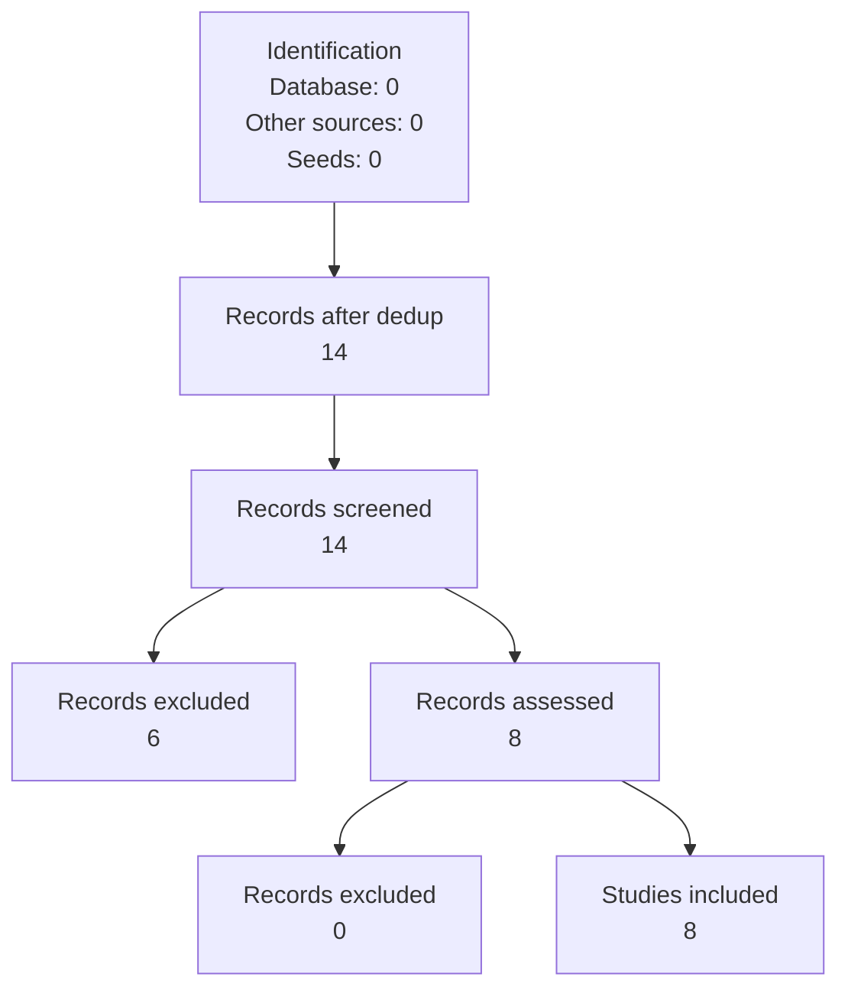

# Methods

<!--
Structure: sections_manifest.json (from SKILL.md v1.2.0)
Model: CONSORT/PRISMA
Tone: clear, detailed, human-like academic, past tense, sufficient for replication
Word count: 800
Rules: No em-dashes; Do not report results; Detail sufficient for replication
Full prompt: SKILL.md
-->

## Study design and justification
[Content placeholder: Study design and justification for  [@su2024evor, @tao2025racg, @zhang2023repocoder, @wang2025coderagbench, @shrivastava2023repofusion, @parvez2021ragcode, @jimenez2023swebench, @yang2024sweagent]]

## Research setting and timeframe
[Content placeholder: Research setting and timeframe for  [@su2024evor, @tao2025racg, @zhang2023repocoder, @wang2025coderagbench, @shrivastava2023repofusion, @parvez2021ragcode, @jimenez2023swebench, @yang2024sweagent]]

## Ethics statement: approval, institution, informed consent
[Content placeholder: Ethics statement: approval, institution, informed consent for  [@su2024evor, @tao2025racg, @zhang2023repocoder, @wang2025coderagbench, @shrivastava2023repofusion, @parvez2021ragcode, @jimenez2023swebench, @yang2024sweagent]]

## Participants or subjects: population, sampling, inclusion/exclusion, demographics
[Content placeholder: Participants or subjects: population, sampling, inclusion/exclusion, demographics for  [@su2024evor, @tao2025racg, @zhang2023repocoder, @wang2025coderagbench, @shrivastava2023repofusion, @parvez2021ragcode, @jimenez2023swebench, @yang2024sweagent]]

## Equipment and materials: tools, devices, substances with justification
[Content placeholder: Equipment and materials: tools, devices, substances with justification for  [@su2024evor, @tao2025racg, @zhang2023repocoder, @wang2025coderagbench, @shrivastava2023repofusion, @parvez2021ragcode, @jimenez2023swebench, @yang2024sweagent]]

## Study procedures: chronological, interventions, data collection
[Content placeholder: Study procedures: chronological, interventions, data collection for  [@su2024evor, @tao2025racg, @zhang2023repocoder, @wang2025coderagbench, @shrivastava2023repofusion, @parvez2021ragcode, @jimenez2023swebench, @yang2024sweagent]]

## Outcome measures: primary and secondary outcomes
[Content placeholder: Outcome measures: primary and secondary outcomes for  [@su2024evor, @tao2025racg, @zhang2023repocoder, @wang2025coderagbench, @shrivastava2023repofusion, @parvez2021ragcode, @jimenez2023swebench, @yang2024sweagent]]

## Statistical analysis: tests, significance level, power analysis, software
[Content placeholder: Statistical analysis: tests, significance level, power analysis, software for  [@su2024evor, @tao2025racg, @zhang2023repocoder, @wang2025coderagbench, @shrivastava2023repofusion, @parvez2021ragcode, @jimenez2023swebench, @yang2024sweagent]]

## PRISMA Flow Diagram

